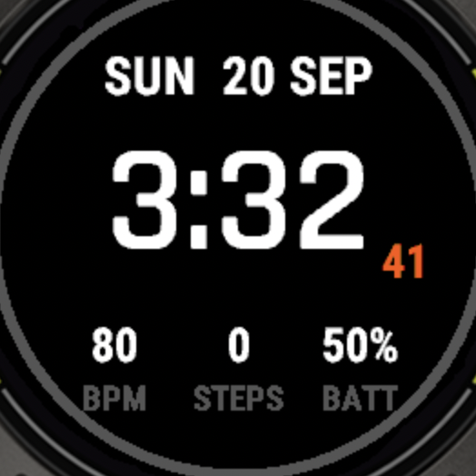
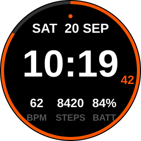

# Ridgeline — Garmin Enduro 3 watch face

A high-legibility Monkey C watch face: oversized time, date, step-goal ring,
heart rate / steps / battery row, notification dot. Built for the Enduro 3's
280×280 memory-in-pixel display (black background, no gradients — the things MIP
actually renders well).

Verified on hardware: built with Connect IQ SDK 9.2.0, run in the Enduro 3
simulator (above), side-loaded and applied on an Enduro 3.

The step-goal ring is not visible in that capture because the simulator
reports zero steps by default — at 0% `drawStepRing` draws only the dim
track, which sits 5px inside the bezel. `preview.svg` below shows the ring
at 84%.

## What you need (one-time, ~20 minutes)

1. **Connect IQ SDK Manager** — <https://developer.garmin.com/connect-iq/sdk/>
   On macOS: `brew install --cask connectiq-sdk-manager`.

   Installing the app is **not** the same as installing an SDK. Launch
   `SdkManager.app`, sign in with your Garmin account, install the latest SDK
   from the *SDK* tab, then in the *Devices* tab tick **Enduro 3** and download
   it. Without that second step `monkeyc` fails on an unknown device id.

   You can confirm both landed:

       ls ~/Library/Application\ Support/Garmin/ConnectIQ/Sdks
       ls ~/Library/Application\ Support/Garmin/ConnectIQ/Devices/enduro3

2. **A developer key.** VS Code's `Monkey C: Generate a Developer Key` does
   this, but the extension is not required — the key is an ordinary RSA key in
   PKCS#8 DER:

       mkdir -p ~/.garmin && cd ~/.garmin
       openssl genrsa -out developer_key.pem 4096
       openssl pkcs8 -topk8 -inform PEM -outform DER \
         -in developer_key.pem -out developer_key.der -nocrypt
       chmod 600 developer_key.*

   Keep it outside the repo. It is the identity your builds are signed with and
   must never be committed; `.gitignore` covers `*.der` as a backstop.

3. **VS Code + the Monkey C extension** — optional. Useful for
   `Monkey C: Edit Products` (which writes correct device ids into
   `manifest.xml`) and for its debugger. Everything below uses the CLI instead.

## Build

The SDK ships a `monkeyc` CLI, so no editor is needed:

    SDK=$(cat ~/Library/Application\ Support/Garmin/ConnectIQ/current-sdk.cfg)
    "$SDK/bin/monkeyc" \
      -d enduro3 \
      -f monkey.jungle \
      -o build/Ridgeline.prg \
      -y ~/.garmin/developer_key.der

Output lands in `build/` (git-ignored). Only `Ridgeline.prg` goes on the watch;
`gen/`, `*-mir/`, `Ridgeline-settings.json` and `Ridgeline.prg.debug.xml` are
build intermediates.

To see it before it touches hardware:

    "$SDK/bin/connectiq" &                          # launch the simulator
    "$SDK/bin/monkeydo" build/Ridgeline.prg enduro3  # load the app into it

`System.println()` output from the app appears on `monkeydo`'s stdout, which is
the only practical way to read real font metrics and layout values back out —
see *Layout notes* below.

### Strict type checking

`monkeyc -l 3` currently reports ~78 errors. Nearly all are missing type
annotations (`Member 'x' is untyped`, then `Cannot determine type for method
invocation` cascading from every `Any`). Three more are null-narrowing
limitations: the checker will not follow `(x == null) ? 0 : x` or a `||`
short-circuit, so `drawStepRing` and `drawMetrics` flag despite being safe.

One is a genuine API wart worth knowing: `Gregorian.Info` declares `month` and
`day_of_week` as `Number or String`, and they are only `String` under
`FORMAT_MEDIUM`. `.toUpper()` on them therefore fails the strict checker.
Verified correct at runtime — the face renders without throwing — but it is not
provably safe from the types alone.

The default type-check level builds clean.

## Install on the watch — no app store needed

The Enduro 3 talks USB **MTP**, not mass storage — it will *not* appear in
Finder as a drive, and macOS has no native MTP support. You need a transfer
client first:

    brew install --cask openmtp

(Android File Transfer is the older answer, but it has been unmaintained for
years and tends to fail on current macOS. On Linux, MTP works natively through
gvfs and no extra client is needed.)

1. Connect the Enduro 3 by USB and open OpenMTP. The watch shows up on the
   device side of the split pane. If nothing appears, check the cable actually
   carries data — Garmin's connector charges over charge-only cables while
   never enumerating.
2. Copy `build/Ridgeline.prg` into **`GARMIN/APPS/`** on the watch. Create
   `APPS` if it is missing; it does not exist on a watch that has never had a
   side-loaded app.
3. Eject from OpenMTP, then unplug. The watch re-indexes apps on disconnect.
4. On the watch: hold **UP/MENU** → *Watch Face* → scroll to **Ridgeline** →
   *Apply*.

Side-loading skips Garmin's store review entirely. If you later want it on the
store, that is a separate developer-account submission, and the placeholder
app id in `manifest.xml` must be regenerated first.

## Settings

Editable from Garmin Connect (Connect IQ → Ridgeline → Settings):

- Accent colour (orange / red / green / blue / yellow / white)
- Seconds on wrist-raise (off saves battery)
- Step-goal ring on/off

Side-loaded app settings occasionally don't sync. If so, just change the
defaults in `resources/properties.xml` and rebuild.

## Layout notes

Layout is expressed in fractions of screen height so it scales across devices,
but two things are **not** portable and caused real bugs:

**Font heights are device-specific and larger than they look.** Measured on an
Enduro 3 via `dc.getFontHeight()`:

| Font                   | Height |
| ---------------------- | -----: |
| `FONT_NUMBER_THAI_HOT` |    129 |
| `FONT_NUMBER_HOT`      |    107 |
| `FONT_SMALL`           |     34 |
| `FONT_TINY`            |     30 |
| `FONT_XTINY`           |     22 |

A consequence: `drawTime` prefers `FONT_NUMBER_THAI_HOT` but rejects it when it
exceeds `h * 0.40` = 112px. At 129px it **always** exceeds that on the Enduro 3,
so this device never uses it and always renders at `FONT_NUMBER_HOT`.

**There is no room below the time.** With a 107px time font centred at
`cy - h*0.05`, the digits end at y=179.5 and the metric rows begin at y=189.4 —
about 15px of clearance, narrower than `FONT_XTINY` at 22px. No font fits
there. Seconds therefore render in the *lower right of the time block*, not
beneath it, and `drawTime` returns `[rightEdgeX, centreY, fontHeight]` so the
placement measures the text actually drawn rather than assuming a width.

**The bezel clips the corners of the lower rows.** The display is round, so
usable width shrinks as you move away from centre. At the label row's baseline
(y≈244) only x≈47–233 is on-screen, which is why the outer metric columns sit
at `0.26`/`0.74` rather than `0.23`/`0.77`.

Label placement is derived from `getFontHeight()` on both fonts rather than a
second hardcoded fraction, so the gap survives whatever metrics a different
device reports.

To re-measure on another device, print from `onLayout(dc)` and read the values
off `monkeydo` stdout — the SDK does not publish these per-device.

## Contributing

Issues and pull requests are welcome. See [CONTRIBUTING.md](CONTRIBUTING.md) for
what to include in a contribution, how to verify a build, and why CI does not
compile the device binary.

## Files

- `source/RidgelineView.mc` — all the drawing.
- `source/RidgelineApp.mc` — entry point, settings reload.
- `manifest.xml` — app id, target devices, permissions.
- `resources/` — strings, settings, launcher icon.
- `screenshot.png` — Enduro 3 simulator capture of the current layout.
- `preview.svg` — layout reference drawn from the measured metrics above,
  showing the step ring partway round. Regenerate if the layout changes.

## Battery note

Seconds force a 1 Hz redraw while the wrist is raised; `onEnterSleep` drops back
to once-a-minute. This is the normal cost of any seconds-displaying face — turn
seconds off in settings if you want the stock-face battery life back.

## Continuous integration

`checks.yml` runs on every push and pull request and needs no credentials:
XML and SVG well-formedness, a guard against key material or build output
being committed, and relative-link validation across the Markdown.

There is deliberately **no automated device build**. The Connect IQ SDK ships
no device definitions — they are a separate, authenticated download — so
building for a specific watch in CI requires Garmin account credentials. Those
are full-privilege personal credentials rather than scoped tokens, and the
decision was not to place them in a public repository's secrets (issue #1).

`build.yml` documents what such a build would require and is manual-dispatch
only. It fails immediately unless `GARMIN_USERNAME`, `GARMIN_PASSWORD` and the
`CIQ_AGREEMENT_HASH` variable are set. Builds are expected to be local, per
the *Build* section above.

## Other devices

`manifest.xml` also lists `enduro2`, `fenix7`, `fenix7x` and `fr965`. Only
`enduro3` has been built and run. The other four need their device definitions
downloaded in SDK Manager before they will build, and the fr965 in particular
is a 454×454 AMOLED — the layout will scale but the font-height thresholds
above should be re-checked before trusting it.

## License

Apache License 2.0 — see [LICENSE](LICENSE).
